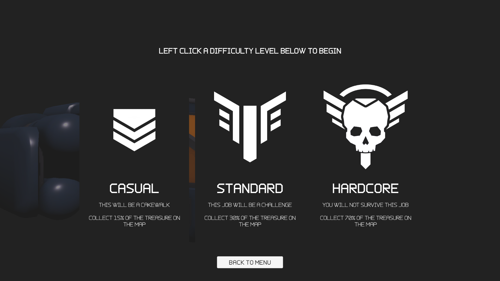
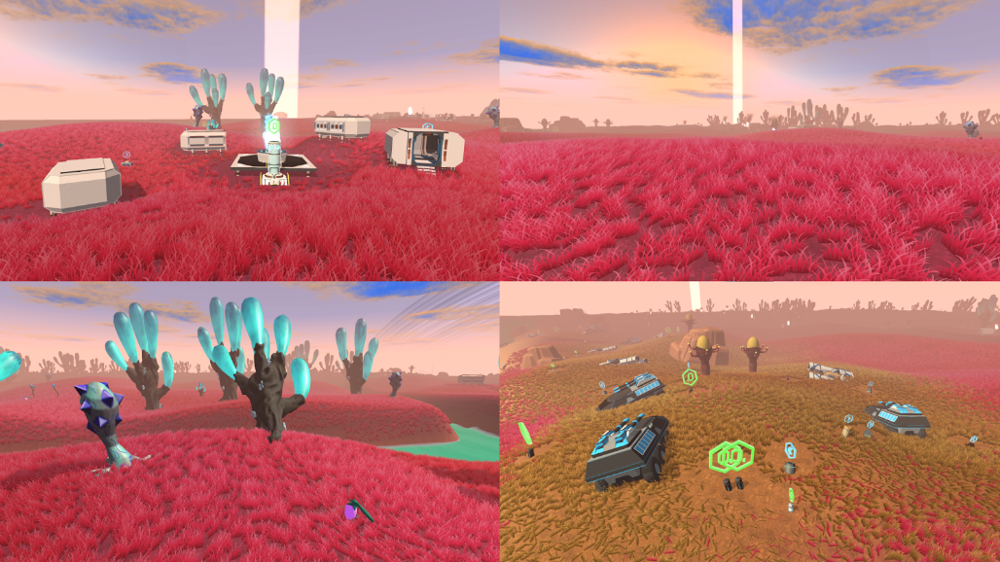
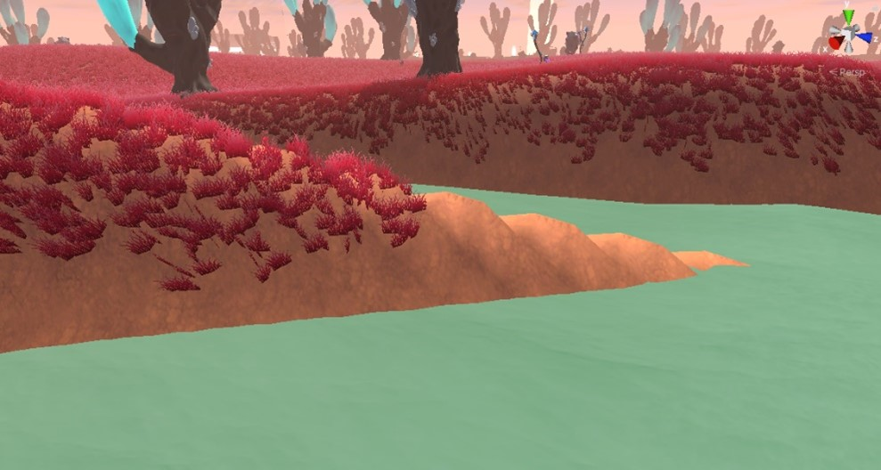

**The University of Melbourne**
# COMP30019 – Graphics and Interaction

Final Electronic Submission (Project): **4pm, November 1**

Game Trailer Link: https://www.youtube.com/watch?v=foX0ulAazAI

# Project-2 README

## Technologies
Project is created with:
* Unity 2021.1.13f1

## Table of contents
1) [Brief explanation of the game](#brief-explanation-of-the-game)
2) [How to use it (especially the user interface aspects)](#how-to-use-it)
3) [How we designed objects and entities](#how-we-designed-objects-and-entities)
4) [How we handled the graphics pipeline and camera motion](#graphics-pipeline-and-camera-motion)
5) [The procedural generation technique and/or algorithm used, including a high level description of the implementation details](#procedural-generation)
6) [Descriptions of how the custom shaders work (and which two should be marked)](#shaders)
7) [A description of the particle system we wish to be marked and how to locate it in our Unity project](#particle-system)
8) [Description of the querying and observational methods used, including a description of the participants (how many, demographics), description of the methodology (which techniques did we use, what did we have participants do, how did we record the data), and feedback gathered](#evaluation)
9) [Document the changes made to our game based on the information collected during the evaluation](#changes-made-from-evaluation)
10) [References and external resources that we used](#references)
11) [A description of the contributions made by each member of the group](#contributions)
12) [Appendix](#appendix)

## Brief explanation of the game

Scavenger is a collection game, which thrives on procedurally generated environments and treasure. From a first person perspective, the player explores an island on an unknown alien planet.

To return to Earth, the player must reach a target number of credit points by picking up various items scattered across the world. Each object has an assigned value, and its corresponding value is credited to the player upon collection.

Meanwhile, players must also monitor the level of their oxygen, as it depletes continuously throughout the game. Additionally, sprinting in order to move across the map faster drains oxygen at a faster rate. Oxygen may be refilled via oxygen farms at campsites, or by collecting oxygen tanks that are procedurally scattered across the world. Players must then be strategic in order to balance exploration, object collection and staying alive.

## How to use it

The game is designed to be fluid and intuitive, and requires a mouse and keyboard to play.

### Main Menu

When players first launch, they are greeted with a familiar and engaging main menu, allowing them to either start a game or exit to desktop.

  

As the player starts a new game, they are prompted to select a difficulty level suitable to their experience. This offers new players an immersive yet enjoyable experience, while presenting veterans a new challenge to tackle.

  

### Loading screen

The loading screen pairs a black background with white text and two spinning circles. The "Loading" text resides in the bottom left, and below it is a different tip each round for the player. Two spinning circles occupy the bottom right. Both spin in opposite directions and represent system activity while the game loads.

  

### Tutorial

To introduce first-time players, Scavenger comes with a short, interactive tutorial to get them up and going in no time. These tutorial prompts each have short, brief messages with white text, against a black, semi-transparent backdrop with a gradient horizontally from the centre outwards. This ensures that texts are legible, clear, and can be skimmed through. 

  

  <i>These inform players of the game's controls, turning green to indicate successful use of a button or key.</i>

Players are also directed toward oxygen farms and treasure via an arrow on the ground:

  

Finally, the player is briefed with the goal of the game - to collect enough credits and return to the ship.

Players are able to freely experiment with various strategies to balance exploration, treasure collection and survival, so that they may reach their credit target.

### In-game UI

Once in the game, the player is greeted by the Heads-Up-Display (HUD), which consists of
- A circular crosshair.
- Oxygen level indicator
- Credit counter: total credits collected as a proportion of the target number of credits

  

#### _Circular Crosshair_

The circular crosshair was custom designed for an exploration and collection based game, instead of a combat-focused one. The two white rings of the crosshair promotes greater contrast between it and the surroundings, while markings within these two rings is used to indicate rotation - which occurs when players hover over an item, signifying to them that the item is interactable.

#### _Oxygen Level Indicator_

The oxygen bar is situated in the bottom left, and consists of a descriptive text above a white bar, all against the same black, semi-transparent backdrop with a gradient from top to bottom.

#### _Credit counter_

The credit counter is centred at the top of the display, with no backdrop. The title is displayed in a thinner font than the credit number below it, providing a sense of hierarchy, while emphasising and guiding the player's eyes towards the counter.

#### _Collecting treasure_

  

As seen above, a treasure item can be spotted from afar by its blue, spinning hologram depicting a credit symbol (a "c" with a line through it).

Upon hovering over a treasure item, the title of the object and its value in credits is presented to the players below the crosshair, providing context regarding the object and its surroundings, while informing players the value of said object.

Upon left-clicking, the item disappears from the world, and the player's credit amount increases.

#### _Refilling oxygen_

  

As seen above, oxygen farms and tanks can be spotted from afar by their green, spinning holograms depicting an oxygen symbol ("O2").

Upon hovering over an oxygen farm, text below the title "Oxygen Farm" instructs the player to left-click to refill their oxygen.

Upon hovering over a tank, text below the title "Oxygen Tank" indicates by how much percent this tank will refill.

Additionally, when players collect an oxygen tank or use an oxygen farm, a green vignette appears briefly on-screen, with a particle system ring and green plus sign icons floating upwards for a short period of time.

  

This indicates a "positive event", and gives players more immersive feedback for their in-game actions. Contrast this with the glowing red vignette that appears when the player is low on oxygen, which indicates a "negative event". This reminds players of their oxygen level, and alerts them to refill their tank quickly by creating a sense of urgency.

### Pause menu

While in game, pressing the ESC key will pause the game, presenting the player with options to resume the game, return to the main menu, or quit the game.

  

### Ending the game

Once players collect enough credits, they are informed via a notification:

  

At this point, they are able to return to their ship, after which they are presented with a victory screen.

  

  <i>This screen lets them return to the main menu, as well as informs them of the extra credits they collected so as to recognise the "extra mile" the player went</i>

However, as players run out of oxygen, the oxygen bar will appear red instead of white, and the borders of the screen will be tinted with dark red.

  

When their oxygen hits zero, and they will fall to the ground and be presented with a game over screen.

  

### UI Design Choices

The UI design of this game is based around a flat design language, rather than a skeuomorphic design language typically found in games of similar genre. This enables an intuitive and elegant experience that continues to complement the sci-fi genre of the game.

The design utilises a monochrome colour palette that is simple, eye-catching, and highly legible on texts. The overarching font used in this game is Charge Vector. It is an elegant, straight font of the Sans-Serif typeface, coupled with chamfered edges, and comes with four weights. It is a futuristic looking font that is clean, minimalistic, and highly legible, a perfect pairing with the low-poly theme of the game.

Overall, the game UI was designed to be straightforward, clean, and transparent. It utilises simple and intuitive screens and menus, paired with an elegant and legible font that complements the game's theme. It ensures that players of all levels are able to navigate through the game, and take full advantage of the interface for an ultimately fantastic user experience. 

## How we designed objects and entities

### Mesh choice

The assets used in designing different objects and entities were acquired from several online resources, such as Itch.io, Sketchfab and the Unity Asset Store.

To establish the atmosphere and mood of an alien world, we selected "unnatural" plants and trees, as well as futuristic, man-made vehicle and collectible item models. By creating a distinction between natural and man-made objects, we were able to create a better sense of visual contrast between treasure items that could be picked up, and models that only served as "props" to enhance the environment.

To maintain a consistent aesthetic, we opted to remain with semi-low poly, stylised assets, given that a stylised game (as opposed to a realistic one) would be better suited to a casual, fantastical sci-fi alien planet. On the other hand, an aesthetic that was too low-poly and simple might risk taking the "wonder" and immersion out of wandering the world, since it might feel too much like an artistic showcase rather than a real planet.

  

  <i>These images showcase our semi-low poly, stylised mesh choice.</i>

### Environment colour palette

Additionally, we selected colour palettes with non-Earth like colours for our vegetation. For instance, we primarily used red grass, blue trees and purple plants, as opposed to green or brown colours, for most of the environment.

However, there were exceptions with vegetation in dry areas (which involved a green and brown colour palette), since we aimed for irony in that plants in this world are typically bright colours (red, blue, purple), but turn green and brown under strange situations (e.g. lack of hydration). This contrasts with Earth's vegetation, where plants are typically green and brown, and only under unusual situations do they turn bright colours (blooming or fruit season, exotic tropical plants or fungi). This stark contrast helped to reinforce the strange, foreign and alien atmosphere of the game.

  

  <i>These images illustrate our primary choices of colour for our environments to attempt to invoke an alien atmosphere.</i>

### Skybox

Additionally, we also decided that the sky would not be its typical sky blue with white clouds, but instead feature a more reddish hue with unnaturally vibrant blue clouds. 

## Graphics pipeline and camera motion

### Graphics Pipeline

  

We modify the rendering pipeline by changing the vertex shader and fragment shader steps with our water and hologram shader programs. These shaders modify the positions of the vertices on the models, and they also modify how each pixel is drawn based on factors such as time and lighting.

When creating our game, we also chose to use the universal rendering pipeline over the built-in pipeline provided by Unity. One advantage is that it improved our game’s performance. As shown below, the universal rendering pipeline gives improvements for both CPU and GPU frame time.

  

  <i>The performance of the universal rendering pipeline</i>

 

  

  <i>The performance of Unity’s built-in rendering pipeline</i>

A major contributor to this increased performance is improved batching. The universal rendering pipeline batches by shader instead of material, increasing the group size and reducing CPU overhead. This was especially helpful for our game since almost all of the objects in our scenes shared the same shaders but had highly varied materials, so this gave us a significant performance increase.

The universal rendering pipeline also allowed us to easily integrate post-processing effects without taking major hits to our performance. We decided to use Unity’s motion blur, bloom, and lens distortion effects to immerse our players in the environment and improve the aesthetics of our game. These affect the fragment shader step of the rendering pipeline by applying effects over a render of what the player’s camera sees fetched from memory.

### Camera Motion

To control the camera, we created a camera object and placed it inside our player object. This meant that, whenever our player would move or rotate, our camera would move and rotate with the player. To control camera movement, we linked the horizontal movement of the camera to the rotation of the player, allowing the player to change direction whenever the mouse would move. However, we then linked vertical movement to just the upward and downward rotation of the camera, as linking this to the player would cause problems with movement. For the vertical rotation, we lock the rotation between a set of angles so that the player cannot look “upside-down” by rotating the camera too far. The code for controlling the player's rotation and camera can be found at `Assets/Scripts/PlayerController.cs`.

We also have a "victory camera" that gets created in `Assets/Scripts/VictoryScreen.cs` whenever the player wins the game. This camera looks up to the sky and rotates with time, and cannot be controlled by the player. To switch to this camera, we set a boolean on the camera called `enabled` to true - which Unity then interprets as swapping the original camera out for the newly-enabled object.

## Procedural Generation

Procedural generation is used to
- Create the terrain of the island
- Place items throughout the map to balance the game. These are:
  - Oxygen tanks and oxygen farms
  - Treasure (low-value and high-value)
  - Clutter (non-interactable except for collision)

The algorithm is implemented in `Assets/Scripts/ProceduralTerrain.cs`. The map is randomised with each run of the game, making each play-through unique. There are four major biomes in the game:
- [The River](#the-river-inside-and-near-it)
- [The Beach](#the-beach)
- [The Red Grassland](#the-red-grassland)
- [The Cliffs](#the-cliffs)

### The River (Inside and Near It)
The map features a river designed as a fractal tree, as shown below: 

  

  <i>An animation showing how branches for a river from the game are forced to follow a certain direction, with the red cone representing the limits for the direction of the branches</i>

To create this river, the terrain is lowered in a way that emulates the fractal branch it is closest to – simulating a sunken riverbed in the fractal tree pattern.

However, problems arose when branches generated too close to each other, causing narrow strips of land to form and creating visually unappealing polygons.

  

  <i>A screenshot from a previous version of the game, showing jagged polygons appearing in the terrain, generated with an older version of the algorithm</i>

This problem was solved by having the terrain consider all branches within a distance of 15 units to it (instead of just considering its closest branch). This prevented narrow strips of land from forming, thus creating a network of “pools” instead:

  

Additionally, the terrain texture in this riverbed appears as “river sand” texture, as opposed to the rest of the terrain.
To create the actual water, throughout the game, a large square water plane also appears near the player (“following” the player), appearing at an appropriate height such that it is visible in the riverbed but, at other times, is hidden beneath the rest of the (higher) terrain. This simulates the river “filling” the riverbed, while it is invisible elsewhere.

_How this balances the game_

The river is the “backbone” of the map. It is balanced to form the “safe but boring” part of the island. This effect is achieved via the following:

- At close distances to the river (in the Red Grassland area), campfires with oxygen farms spawn, with camp clutter spawning around these campfires, and low-value treasure spawning in circles around those pieces of camp clutter. Since these camps spawn frequently near rivers, the player becomes “trained” to see the river as a safe area (due to the oxygen farms), but unfruitful (no high-value treasure present).
  

    
  

- In the river itself, the game spawns oxygen tanks frequently for additional safety. It will also, very occasionally, spawn Attack Drones (the most expensive treasure in the game) as a welcome surprise for swimming.
- For decorative purposes, blue river trees also spawn near the river, and small plants in circles around them.

### The Beach

  

Scavenger is located on an island, which is shaped as a square. At the edges of this island, the terrain’s height gradually slopes down. As mentioned above, a large square water plane constantly follows the player – thus, due to the lower ground height, the water becomes visible when approaching the island’s edges. Additionally, the terrain texture near the edges of the island fade into a “beach sand” texture, simulating a beachy biome.

_How this balances the game_

The beach is designed to have slightly more value than the river (in terms of credits), but slightly less safe. This effect is achieved via the following:

- Human clutter (e.g. water vehicles) spawns along the beach. Then, mid-value treasure and oxygen tanks spawn in circles around them.
- Natural clutter: trees and large rocks also spawn along the beach. To increase the feeling of safety, oxygen tanks spawn in circles around them.

### The Red Grassland

  

This biome makes up the majority of the map. Aside from dips in terrain height as mentioned above, slight bumpiness (via Perlin noise) is also applied to this area to keep the landscape interesting.

Everywhere in this region, red grass is spawned using Unity’s terrain detail system. The terrain texture used here is a “red soil” texture.

As mentioned in the River section, camps spawn in this area. Elaborating on this, additional effects may also be performed when an item is placed down:

- Grass removal: removing grass around the item. This is used by campfires, camp clutter, all oxygen tanks and any treasure spawning at the Cliffs.
- Terrain flattening: flattens the terrain beneath the item (to avoid awkward jutting behaviour for large items). This is used by campfires, camp clutter and camp treasure.
- Normal to terrain: rotates the item such that it aligns with the terrain’s normal (so that it lies flat against the terrain’s tangent). This is used by everything in and near the river, and human clutter at the Beach and Cliffs.

_How this balances the game_

This area is designed to be intimidating. With large expanses of oxygen and treasure-less grassland (except for camps), running aimlessly through this area without a proper strategy could cause the player’s oxygen to deplete. Hence, aside from camps, items do not spawn in this area.

### The Cliffs

  

At a far distance from the river, Scavenger’s map is designed to be dry. To achieve this, when items are placed down in this area, they remove the red grass in a large radius around them before replacing it with dried green grass. They additionally change the terrain texture to a dried soil texture. 

_How this balances the game_

The cliffs are designed to be the most fruitful area for collecting high-value treasure, but the least safe. This effect is achieved via the following:

- Human clutter (e.g. land vehicles, littered cliffs) spawn in this area, and high-value treasure and oxygen tanks spawn in circles around them
- Natural clutter: as opposed to the Beach, trees at the Cliffs only have other small desert plants encircling them, instead of oxygen, making this area less safe
- The Cliffs are also guaranteed to be farther from camps than the Beach, adding to the thrill of managing the player’s oxygen level as it can quickly deplete with aimless wandering

### Final Notes on Procedural Generation

To balance the game differently, the following variables can be tweaked via the `ProceduralTerrain` component:
- The number of treasure items that spawn near the river, at camps, at the cliffs and at the beach
- The number of oxygen tanks at the cliffs and the beach
as well
- The number of camp clutter items
- In Standard mode, the player is given a target number of credits equal to 30% of all the treasure on the map – for Casual mode, this is decreased to 15%, and for Hardcore, this is increased to 75%. These percentages can be modified.
  - Harder levels thus require a more rigorous, lengthy and thorough exploration of the map.
- The minimum and maximum distances from the river that cliffs, camps, riverside items and in-river items spawn
- The minimum and maximum distance from the river that the player's spaceship and starting oxygen farm will spawn
  - _Note: these starting items currently spawn from about the same distance as camps (minimum) to midway between the cliffs and camps (maximum). The player then spawns next to them._

All of these numbers have been carefully estimated and tweaked over several runs, to achieve a suitable level of difficulty and balance.

## Shaders

###  Water Effect (Marked)

The water effect consists of two parts:
- An underwater screen shader
- A water surface shader

The goal of the water effect was to allow us to create the river and ocean (beach), both major parts of our procedural generation system and representing main biomes in the game. 

### _Underwater Screen Shader_

The code for the underwater screen shader can be found at `Assets/Shaders/Camera_Shader.shader`.

  

 
To make entering the water feel more immersive, when the player is under the water plane, we added an underwater screen shader that simulates being underwater.

  

The shader works by checking the depth of the pixels on the screen. Pixels closer to the player have a blue-ish tint, while pixels further away are replaced with a solid blue color. This results in an effect that replicates swimming in water with poor long-distance visibility. The blending formula uses the same type of blending as described in Workshop 4.

The shader also has a slight fade-in as the player enters the water, to account for small inaccuracies in the check to see if the player is below the water plane.

### _Water Surface Shader_

_This is for the shader based on one taught in labs_

The code for this shader can be located at `Assets/Shaders/Water_Shader.shader`.

#### _Waviness_
 
The water shader is used to simulate the effect of a river or ocean. As explained earlier, the water itself is a subdivided plane that follows the player as they move. To make the water have believable waves, we make each vertex in the water mesh sample a coordinate on a heightmap based on its world position. This keeps the waves consistent wherever the player moves. This heightmap moves with time, which has the effect of moving the vertices up and down to make the surface look wavy.

  

#### _Transparency (depending on depth)_

In order to make the water feel more real, we also change the transparency and texture of the water depending on how deep it is. To find this depth, we take the difference between the distance from the player to the water surface pixels and the distance from the player to the pixels of the objects underneath the water. If the depth value is low (i.e. shallower water, typically at the edges of the water), the water is colored with a lighter blue and made more transparent. However, if it is higher (i.e. deeper water, typically in the center), we use a darker blue and make the water opaque.

  

#### _Foam_

Another element of the water shader is the foaming effect. To create the foam, we sample the heightmap for every vertex as with the wave effect, but we use the position of the heightmap a second into the future instead (so that the foam realistically appears at the “front” of the wave rather than directly atop it). If the height at this point is above a certain limit, we then blend in the foam texture. This foam texture moves with time, and is overlaid with a slower-moving version of itself and averaged out to increase realism.

  

#### _Specular Highlights_

One final element of the water shader is the specular highlights. To produce this effect, we take an input normal map and, similar to the foam texture, make it move with time, overlay it on top of itself, and average the result out to produce a natural looking set of surface normals. Light is then reflected off these normals, and we check how close the direction of the light is to the direction the player is looking using the dot product of the former and opposite of the latter. The output of this calculation is used to determine the specular highlighting, which is added to the water’s surface color.

_Note: initially, we had also implemented a ripple/dipping water effect that would appear when the player waded through the water, so as to create a dynamic water plane that would interact with the player. This mostly involved a vertex shader, displacing vertices surrounding the player. However, the effect was barely noticeable given that the game is played in first person, and so the team decided this would provide little additional value to the player's experience. Hence, this was left out._

### _Benefits over a CPU approach_

The shader gives significant benefits over trying to replicate the same effect on the CPU as it can parallelize the operations required. The effect requires calculations that read from and change the values of several hundred thousand pixels and vertices for rendering the water plane. Executing this code on the CPU would be slow, as on a typical 8-core CPU only 16 threads can be run in parallel. However, when executing the code in a shader the GPU can schedule billions of threads and execute tens of thousands in parallel, significantly increasing the speed of the operation.

### Hologram Effect (Marked)

_This is for the shader that was not taught in labs_

  

  <i>Showcases what happens to holograms in the game as oxygen slowly depletes. They become more and more "glitchy" and "chaotic".</i>

The hologram effect consists of the hologram vertex and fragment shaders. The effect is meant to give players an indicator of where resources are on the map. It also serves as a way for players to indirectly know their oxygen levels, as the hologram becomes glitchier as the player’s oxygen levels decrease. The hologram effect can be found at `Assets/Shaders/Glitch_Shader.shader`.

### _Hologram Vertex Shader_
 
The hologram vertex shader’s main purpose is to make the hologram glitch left and right when triggered by an external script. The script will randomly change the value of an `isGlitching` value inside the shader, which can be between 0 and 1. This value is multiplied by a glitch offset, which gets applied to each vertex.

The glitch offset is a sine wave that changes based on time and the position of the vertex on the screen. The vertices cannot follow the sine wave properly as the gaps between them are larger than one wave period, so the sine wave is able to model randomness in the shader. The offset is also done relative to screen space rather than the world space position of the vertices.

This was done since we wanted to make it feel like the holograms were being projected from the player’s helmet via some sort of AR system, and that any glitches are from faults with their equipment. We further emphasised this effect by linking the magnitude of the offset to the player’s oxygen levels, with the amount each vertex is moved while glitching increasing as it gets lower.

The result of setting `isGlitching` to true versus false results in something similar to the below:

  

### _Hologram Fragment Shader_

The hologram fragment shader colours and blends the pixels to make the object look like a hologram. The shader starts by setting the blend mode to enable transparency. It then takes inputs for a color map, as well as for a noise texture and glow texture. Rather than having the noise texture and glow texture wrap around the mesh as normal, we used the screen space coordinates to project the texture flat onto the screen. This was to help further with the previously mentioned effect of making it feel like the projections are from the player’s helmet. These textures are overlaid onto the model and move with time, giving an effect that mimics a CRT television.

After this, the pixels are grouped into equally-sized rectangles on the screen. The bottom-left pixel of these rectangles is taken, added with an offset that changes with time, and run into a hash function that produces a pseudo-random value. This value is used to adjust the transparency of all the pixels within the rectangle, and the offset ensures that this transparency is different every frame. This effect attempts to replicate the look of artifacts seen in highly compressed JPEG images and video streams.

  

  <i>Notice the horizontal line in the center of the hologram, as well as how it has been divided up into multiple rectangles to create a glitchy, holographic effect.</i>

Once this has been completed, the normals of the model are used to calculate the fresnel reflection. This is used to give the model a glowy colour around the edges. The fresnel effect, color map, noise texture, glow texture and rectangles effect are blended to produce the final result. Like the vertex shader, the noise texture and rectangle effects become more intense as the level of oxygen decreases - simulating the failure of equipment.

### _Benefits over a CPU approach_

The shader gives a large benefit over using a CPU-based approach again because of throughput. Although there are less pixels present per hologram and less vertices per object - the player can see many holograms at once. This means that we’d still get a significant advantage using the parallel processing capabilities of the GPU.

## Particle system

### Oxygen Refill Effect (Marked)

  

The oxygen refill effect has several purposes. One aim was to distinguish collecting oxygen tanks from regular collectibles, as this was something that confused players during our evaluation sessions. Another reason for adding this effect was to reward players for collecting oxygen tanks, and to make the feeling of reaching an oxygen tank after a close call satisfying and enjoyable.

The particle emitters can be found by going to the `Player` object in `MainScene` and opening the `RestoreParticles` and `RestoreRingParticles` GameObjects, while the materials can be found at `Assets/Material/ParticleSystem/Particle_Restore` and `Assets/Material/ParticleSystem/Particle_RestoreRing`.

The `RestoreParticles` particle system emits green plus-symbols that rise upwards and fade out. These are randomly generated in an upwards-pointing cone, while the RestoreRingParticles system rapidly emits green rings that move upwards and fade out. These particle effects use additive blending to make them glow and be more noticeable. The effect as a whole is meant to give visual feedback to the player that something positive has just happened, and players recognise the plus symbols and upward rings as a visual language for something important being restored. This aims to help players notice their oxygen bar and know to keep an eye on it as they play.

## Evaluation

In evaluating our game, our team gathered 10 volunteers to try our game. 5 were interviewed via a post-task walkthrough, while the other 5 were interviewed via our querying method. 

Our testers were within the age range of 19 to 25 and had a variety of levels of experience with video games that the players themselves measured on a scale of 1 to 10, with 1 being no experience at all with first person computer games and 10 being high familiarity.

A full table of our participants can be viewed in the report's appendix, [here](#participants).

### Observational method

For our observational method, we opted to apply a post-task walkthrough. The majority of the walkthroughs were conducted online via a Zoom call, although a few were conducted in person. After having first requested participants to download the game, interviewers (i.e. our group members) would then give them the task of simply "completing the game". Given the straightforward nature of Scavenger's objective, as well as the in-game tutorial, this was considered sufficiently doable even though participants had never played the game before.

Prior to starting, our players were informed that they would have to record and share their screen until they either won or gave up, and that the interviewer would not speak for the entirety of the playthrough. There was no strict time limit imposed.

To capture an authentic response, they were also informed that they should act as they naturally would, i.e. as if they were playing alone. For instance, they were encouraged to speak aloud if they naturally did so, as well as to try to solve the game themselves rather than expect "hints" from interviewers.

Throughout the gameplay, our interviewers would take freeform notes - electronically, either on a computer or smartphone - on the players' behaviour. This was for the sake of structuring appropriate questions to ask afterward. Primarily, interviewers would pay the most attention to "strange behaviour", i.e. behaviour that was not in line with the game's main objective. For example, did they walk towards an oxygen farm when the tutorial arrow directed them to one, or did they leave in a different direction?

Directly after the playthrough, i.e. once the player had either won or given up, interviewers would query them on **what their intentions were** in specific moments where the player was behaving "strangely". These questions were not designed to elicit suggestions from the players, but merely to discover what their intentions were. However, suggestions were also welcome.

The interviews took about 15-20 minutes each, and were all voice recorded. Here are the guidelines for these queries that were given to the interviewers:

1. During the gameplay, pay particular attention to specific, strange choices that the player makes. Take note of these moments. Examples:
    - _They went to the cliffs at the start of the game (as opposed to following the tutorial and refilling their oxygen)_
    - _They continued collecting treasure and didn't look for oxygen, even when they were dying_
    - _They stood around as if waiting, and did not return to the spaceship to win the game, even when they had collected the target number of credits_
2. At the end of the playthrough, take about a minute to assess the notes you have taken and pick five or more of the most interesting moments.
3. Begin to voice record future interactions between you and your participant.
4. Ask the player five or more specific questions relating to those particularly interesting moments you had decided, querying them on what their intentions were. Examples:
    - _Despite the tutorial urging you to fill your oxygen, what made you explore the cliffs instead of heeding these instructions?_
    - _When you were dying, what made you uninterested in maintaining your oxygen level to stay alive?_
    - _When you had reached your target number of credits, what made you not attempt to win the game by returning to your spaceship?_
5. If they are having trouble recollecting a moment, allow them to watch portions of their gameplay footage to remind them.

Results (in written table form) of these evaluation sessions are available in the report's appendix, [here](#evaluation-results).

### Querying method

For our querying method, interviewers asked players to download the game and play it alone. They were asked to play it as many times as necessary such that they felt familiar with the game and confident about how to play it.

Then, within a week, our interviewers conducted open-ended interviews with the players via online Zoom calls. These interviews were structured around a custom-made questionnaire about Scavenger, covering four major components:

- Overall aesthetic
- Controls
- Tutorial
- Difficulty

A full list of the questions can be viewed in the report's appendix, [here](#querying-method-interview-questions).

These questions were written with the intent of only being "starter questions" - in other words, the interviewers were expected to ask more questions in between them, as directed by the conversation. This was in keeping with the open-ended nature of the interview. However, a few guidelines for interviewers to follow when directing the conversation were given:

- Interviewers should aim to extract more general thoughts and impressions of Scavenger.
  - The starter questions are designed to help with this. However, interviewers must still bear this in mind, in case a player misunderstands the question and begins to discuss only specific gameplay moments.
  - This is in contrast with asking them about their specific thoughts, which had been the focus using the observational method.
- Interviewers are reminded to encourage suggestions from players.
  - For instance, if a player takes issue with a part of the game, they should be asked how they believe we could improve the game.
  - However, this is only optional, and need not be pushed if the player cannot think of any suggestions.
- Interviewers should not phrase questions or comments in such a way that pressures participants to answer in a certain way, thereby risking illegitimate responses.
  - For example, rather than asking, "Don't you think the vegetation looks really consistent?", ask instead, "What are your opinions on the aesthetic consistency of the vegetation?"
- Interviews should cover all starter questions thoroughly. Questions should not be skimmed over in a bid to spend more time on others.

The interviews were voice recorded. Given the discursive nature of these interviews, as opposed to simply reporting user intentions, they lasted slightly longer on average than the post-task walkthrough interviews, taking about 20-30 minutes each.

## Changes made from evaluation

### Informing the player about low oxygen

A problem observed in 4 out of 5 of our post-task walkthrough participants, was a lack of realisation that their oxygen was running low until it was too late. This was usually observed when many players kept collecting treasure even though their oxygen was very low. All reported that this was due to not paying attention to their oxygen bar.

No one reported this among those interviewed via the querying technique, but this may have been attributed to playing the game for longer (as opposed to those who performed the post-task walkthrough). They may have grown used to frequently checking their oxygen bar, knowing that they would lose the game otherwise.

Thus, to make the game friendlier for first-time users, the following changes would occur when oxygen dropped below 20%:

  

    
  

- The oxygen bar would turn red, rather than remain white.
- A dark red tint would appear at the sides of the screen, imitating loss of vision.
- A beeping sound would begin to loop until the player refilled their oxygen.

### Explaining the game mechanics more clearly

Although the interactive tutorial informed players of all mechanics of the game (controls, oxygen maintenance, treasure collection), we observed 5 out of 10 of our participants having trouble understanding what to do, especially in the beginning.

2 participants had been interviewed via our observational method, while the rest had been interviewed via our querying method. Out of these 5 players, 4 attributed this to ignoring the tutorial, due to its lack of noticeability or visibility. As put by one player, it did not "stand out" enough.

Hence, we implemented the following fixes for it:

- Increased font size and increased the opacity of the background behind tutorial text, to improve readability
- Did the same for text that appears upon hover, since sometimes instructions are contained here too (e.g. "Left-click to refill your oxygen" appearing when hovering over the oxygen farm)
- Upon hovering over treasure, oxygen tanks or oxygen farms, text would specify for the player to left-click, as one participant did not realise that this is what they were meant to do
- After regenerating oxygen at an oxygen farm, some players would stand still until the percentage figure reached 100% before walking off. However, this figure actually represented the oxygen farm's "cooldown" time, before it could be used again, and the player did not have to wait for their oxygen to refill. Thus, the text was modified to say, "xx% before ready for re-use" rather than just "xx%".
- One player (Participant 7) did not immediately realise they had reached the target number of credits. After eventually realising, they did not know they had to return to the spaceship in order to win.
  - Hence, we implemented a notification upon reaching the target, which informs the player that their target has been reached and instructs them to return to the spaceship
  - This notification also plays a sound
  

    
  

### Distinguishing oxygen from treasure

Another issue observed in one player (Participant 3) was the inability to tell the difference between treasure items and oxygen tanks.

Hence, the changes below were implemented to address this:

- Blue credit & green oxygen holograms were made to be more opaque and have more vibrant colours, so as to appear more visible.
  

    
  

  

    <i>Previously, holograms were more transparent, to the point where blue holograms appeared purple as they were layered over the red grass. The symbols depicted were also hard to read. Although the two types of holograms could certainly be differentiated, their dullness made them easy to ignore, and so the difference felt too subtle.</i>
  

  

    
  

  

    <i>Now, holograms were much more different, creating a more stark contrast between oxygen tanks and collectibles.</i>
  

- A green particle system effect was implemented to indicate an increase in oxygen (when using an oxygen farm or collecting an oxygen tank). Since this did not occur when collecting treasure, the player would be trained to understand the distinction between oxygen and treasure items.

### Responding to requests for a more challenging experience

Out of 5 participants interviewed under the querying technique, 4 reported that the experience could be more challenging, and gave various suggestions on how to do so. None of those interviewed under the observational method mentioned this - however, this may have been due to the fact that they had only played it once, so they were still coming to grips with how to play the game. On the other hand, the querying group had been given the opportunity to play it multiple times.

Hence, to improve replayability, we decided to implement some of these suggestions:

- Different difficulty settings were implemented: Casual, Standard and Hardcore. These changed the target number of credits to 15%, 30% and 75% of all treasure value in the game, respectively.
- Sprinting in the game would now cause oxygen to deplete 50% faster (under `SPRINT_OXYGEN_DEPLETION` in the `PlayerController` script).
- However, to balance the game so that it would still be possible to win, the maximum sprint acceleration (`MAX_PLAYER_SPRINT`) was also tweaked to allow the player greater speed while sprinting.
- The number of oxygen tanks that could spawn at cliffs was reduced.
- The procedural generation algorithm was modified, to ensure that the player's spaceship and starting oxygen farm would never spawn at the cliffs.
  - Previously, the chance of this happening made the game too easy during those runs, since the player would have an oxygen farm available near the high-value treasure

### Improving experience relating to UI, sound or gameplay

As reported across our participants, there was a broad range of complaints surrounding the UI. These changes we made aimed to fix those: 

- One player (Participant 8) had a higher resolution than average, and so their crosshair was too small, making it difficult to point at items and resulting in the need for multiple clicks. Thus, the central crosshair's size was modified to be relative to the screen, rather than absolute, to scale its size with the player's screen resolution.
- Another player (Participant 4) played the game multiple times, at which point they began to find the tutorial irritating. Hence, the option to skip the tutorial at any stage by pressing "E" was added
- Participant 4 also complained about the lack of a pause function. Hence, we implemented the ability to pause mid-game by pressing "Esc".
- 2 out of 5 participants interviewed via our querying method reported that the ambient music's volume felt too loud, and so we reduced it
- The jump height was increased to the point of being able to jump on the campfire, as Participant 8 found jumping too limiting.
  - Although jumping is not directly useful in achieving the objective, it allows players to quickly exit lower points (i.e. the river), climb on tall objects to scan the horizon or simply have fun by hopping around the map.

### Improving experience relating to aesthetic/environment/objecs

As reported by our participants, there were also various complaints surrounding the game's aesthetic, environment or objects. Hence, these changes aimed to address those: 

- Participant 8 complained that the modular camp buildings were "useless", since they did not contain anything of interest. Hence, some were modified to contain low-value treasure, and these were mixed in with the previous empty buildings.
- 3 out of 5 participants interviewed via our querying method reported that some objects in the game were inconsistent with the overall aesthetic. These were either replaced with different meshes entirely or had their textures edited to look more flat and stylised.
- LODs were repaired to avoid flickering items in the distance, as reported by Participant 4.
- 2 out of 5 participants interviewed by our observational method reported that they did not realise that there were distinct biomes in the game, causing them to wander the map aimlessly rather than to set courses. This made the game less coherent and more tedious to win. Hence, the procedural generation algorithm was modified to alter the colour of grass and the texture of the ground at the cliffs, to distinguish the cliffs from the red grassland.
- Participant 9 reported that the grass ending abruptly before reaching the beach was too jarring. Thus, the grass was modified to reduce more gradually as it approaches the ocean.

### Making the game feel more interesting

The following changes were made to make the game feel more meaningful, diverse and interesting. Although this was not a complaint made directly about any of our participants, our team decided to informally gauge the level of engagement from our players.

Comments about the game generally being unchallenging and slow-paced, coupled with our interviewers' tone of voice, suggested an underlying impression of boredom. Hence, the following changes were made in a bid to increase the player's level of engagement throughout the game:

- More objects in general were added, e.g. weapons, camp clutter, vegetation
- Object placement was modified to feel more "natural" rather than staged. For instance, rather than neatly stacking items on boxes, the boxes were placed at "messier" angles, with some items overturned, in order to better simulate an abandoned campsite.
- A short description of Scavenger's backstory was added into the main menu, during the difficulty selection screen.

## References

### Information Resources Used
Procedural terrain

- https://answers.unity.com/questions/478454/modify-terrain-through-codescript.html
- https://alastaira.wordpress.com/2013/11/14/procedural-terrain-splatmapping/
- https://answers.unity.com/questions/13377/can-i-modify-grass-or-details-on-the-terrain-at-ru.html

Water shader

- https://www.youtube.com/watch?v=gRq-IdShxpU
- https://www.youtube.com/watch?v=7T5o4vZXAvI
- https://dev.rbcafe.com/unity/unity-5.3.3/en/Manual/SL-CameraDepthTexture.html
- https://dev.rbcafe.com/unity/unity-5.3.3/en/Manual/SL-DepthTextures.html
- https://www.ronja-tutorials.com/post/017-postprocessing-depth/
- https://stackoverflow.com/questions/57292257/models-using-unitys-standard-transparent-shader-are-overlapping-themselves

Hologram shader

- https://docs.unity3d.com/Packages/com.unity.shadergraph@6.9/manual/Fresnel-Effect-Node.html
- https://thebookofshaders.com/10/
- https://stackoverflow.com/questions/4200224/random-noise-functions-for-glsl
- https://en.wikibooks.org/wiki/Cg_Programming/Unity/Transparency

### Asset Resources Used
Sealed Beef

- https://sketchfab.com/3d-models/beef-ba4994111ff24568861c60e41dac8815

Large oxygen tank 

- https://sketchfab.com/3d-models/sci-fi-oxygen-tank-8fc54f9755044f2d80c9205c6bc75c98

Small oxygen tank 

- https://sketchfab.com/3d-models/space-capsule-with-energy-cube-3d-4b9ec469ba6046bba7eebb6d7c157ac5

Oxygen Farm 

- https://sketchfab.com/3d-models/oxygen-farm-1-f7f785d5043d4baeb22e12080dbc8ce7

Sci Fi Container

- https://sketchfab.com/3d-models/sci-fi-crate-ammunition-box-1-69fe3211493c4a4db26ad0c4e2e49a83
- https://sketchfab.com/3d-models/sci-fi-stylized-container-84cdeb784c2145a78dba7bbd2fb36650

Sci Fi Weapons 

- https://sketchfab.com/3d-models/sci-fi-cannon-weapon-6be6c1702b8340ab9e4019baa8b75ef6
- https://sketchfab.com/3d-models/sci-fi-weapons-0970d5ed108a422d873d44d7bd8f3659
- https://assetstore.unity.com/packages/3d/props/guns/sci-fi-rifle-low-poly-99671

Sci Fi Drone 

- https://assetstore.unity.com/packages/3d/low-poly-combat-drone-82234

Sci Fi Battery 

- https://sketchfab.com/3d-models/sci-fi-batteries-88a6ae64f3874c57aa5d008ed1d1c5d9

Sci Fi Canned food

- https://sketchfab.com/3d-models/hexaberry-soda-cans-96aa6a20264848ab9c5be2478594ec44

Sci Fi Spaceship 

- https://sketchfab.com/3d-models/spaceship-2-a02be06221454d3f9a36ef7e0ba5631f
- https://sketchfab.com/3d-models/cargo-spaceship-5103d6184e9f4561b9ecd1cae029bcf5

Fuel Tanks

- https://assetstore.unity.com/packages/3d/environments/sci-fi/sci-fi-barrels-40-sample-92986

Other Clutter

- https://sketchfab.com/3d-models/sci-fi-gun-244d6f833cf0498c943006954197d899
- https://sketchfab.com/3d-models/oxygen-farm-1-f7f785d5043d4baeb22e12080dbc8ce7
- https://sketchfab.com/3d-models/sci-fi-weapons-0970d5ed108a422d873d44d7bd8f3659
- https://sketchfab.com/3d-models/sci-fi-cannon-weapon-6be6c1702b8340ab9e4019baa8b75ef6

Vehicles

- https://sketchfab.com/3d-models/cargo-spaceship-5103d6184e9f4561b9ecd1cae029bcf5?fbclid=IwAR1V1pe7nsx2TF1sEiGl4G6qCUqc1CcK1ais23Fd0S1XxuE6Z6Y7SkNIgUg
- https://niko-3d-models.itch.io/free-sc-fi-spaceships-pack
https://assetstore.unity.com/packages/3d/environments/sci-fi/warzone-vehicle-pack-57826

Plants

- https://sketchfab.com/3d-models/fantasy-light-plant-55eb0ab1590f4de59ddd9c874ec90b67
- https://sketchfab.com/3d-models/alien-plants-a38b2f76b44244abb83ce2d4c8d10893
- https://sketchfab.com/3d-models/painterly-hell-flower-school-project-8cc9503705354c5dbbd009db50712041
- https://sketchfab.com/3d-models/mutant-tree-3cd8f6abf1c14469bb4987ca770f3e32
- https://sketchfab.com/3d-models/space-plant-b9d3d2c3e5c641c7abe1af9e2386e61c?fbclid=IwAR0Yn6t65DIXGBKBu-Fxhnw0Kfkp9XXnRP6tjtejKSQrgAPP0pGdoUMl0bc
- https://sketchfab.com/3d-models/buttry-alien-plants-21a960ae5141474bb4d795294d00dc5c
- https://sketchfab.com/3d-models/fantasy-plant-8ef7f017c9c049e1a8f478171e2ad9ba
- https://assetstore.unity.com/packages/3d/environments/fantasy/free-low-poly-lava-plants-145043

Cliffs

- https://sketchfab.com/3d-models/desert-rocks-stones-pack-c2208f5ccc004f1681d27de67fe75799

Skybox

- https://assetstore.unity.com/packages/2d/textures-materials/sky/free-skyboxes-sci-fi-fantasy-184932

Sci-Fi structures/crates

- https://assetstore.unity.com/packages/3d/environments/sci-fi/sci-fi-styled-modular-pack-82913

Music

- https://www.youtube.com/watch?v=yh2AwAm78RQ
- https://www.youtube.com/watch?v=XVbvE0PJyss
- https://www.youtube.com/watch?v=HIdNZlBKrTA
- https://www.youtube.com/watch?v=j71k8yFLAoQ

## Appendix

### Participants

| Participant ID |  Age  | Level of Game Experience | Evaluation Technique
| :---           | :---: |                    :---: |  :---: |
| 1              | 21    | 7                        | Querying
| 2              | 21    | 8                        | Observational
| 3              | 23    | 2                        | Observational
| 4              | 21    | 8                        | Querying
| 5              | 19    | 7                        | Querying
| 6              | 22    | 10                       | Observational
| 7              | 19    | 7                        | Observational
| 8              | 20    | 1                        | Observational
| 9              | 25    | 10                       | Querying
| 10             | 21    | 9.5                      | Querying

### Querying method interview questions

Given the open-ended nature of the interview, the following questions only display "starter questions", which every participant was asked. Other questions may have been asked in between these starter questions.

- Overall aesthetic
  - How well does everything fit together, visually? 
  - Does the game's style feel coherent?
- Controls 
  - Were they intuitive? Complex? 
  - Did they feel smooth, or were they clunky to use?
- Tutorial 
  - Was it useful? Intrusive?
- Difficulty 
  - Was it challenging? 
  - How did you feel about the balance between your oxygen level and collecting items?

### Evaluation results

Key points from the interviews have been summarised in table form below.

### _Observational method results_

| Participant ID | Key Points
| :---           | :---: 
| 2              | Feels like sprinting should be faster
|                | Did not notice the oxygen was running out until it was too late
| 3              | Thought oxygen tanks in the river were “credits”, and so spent the majority of time underwater
|                | Didn’t realise to click items and oxygen, thought they had to walk through holograms
|                | Didn’t notice/bother to read the tutorial, and ended up not refilling oxygen at the nearest camp at the start of the game and instead headed towards the cliffs, then died there from lack of oxygen
|                | Got lost a lot, not understanding that there were different biomes to explore but rather only aimless wandering while trying to collect credit
|                | Didn’t notice oxygen running low until it was very low, or had run out. Affected ability to strategise, and resulted in losing.
|                | Thought they needed to wait for oxygen farm percentage to reach 100% before walking away
| 6             | Sometimes did not pay attention to oxygen until it was too late, due to forgetting
|                | Attention was drawn to the drone’s sound cues
|                | Aimlessly wandered the map for the majority of the time, since they did not notice changes in biome or a difference in the value of treasure depending on location
|                | Assumed that sprinting consumed oxygen faster, tried to avoid sprinting for this reason
| 7              | Got lost frequently
|                | Did not see tutorial and arrow at first
|                | Did not notice target number of credits at first
|                | Did not understand what the percentage at the oxygen tanks meant
|                | Did not realise when the target number of credits had been collected
| 8              | Did not understand what the percentage at the oxygen farm meant
|                | Entered buildings because they were expecting (and hoping) to find items. Lost interest eventually and ignored them. 
|                | Got frustrated at slow movement.
|                | Tried to jump repeatedly on campsites, expressed disappointment that gravity was "too heavy" and that this was not typical of space games
|                | Played the game by being economical with sprinting, assuming there was a sprint / stamina penalty 
|                | Had trouble clicking on objects because crosshair was too small. Had to click a few times.
|                | Did not notice low oxygen until it was too late

### _Querying method results_

| Participant ID | Key Points
| :---           | :---: 
| 1              | Overall aesthetic was very pleasing
|                | Being able to interact with the various objects in the game was fun 
|                | Background music that gives tension makes the game more enjoyable
|                | Controls were intuitive and smooth
|                | Tutorial was helpful but it should stand out more so that a player sees it at first sight
|                | It could have been a more challenging game
|                | Balance of oxygen and roaming was well managed
| 4              | Aesthetic was consistent overall, though some meshes and textures seemed out of place or unfinished (particularly: mushroom trees near the beach, various glossy rather than smooth trees and plants, black food can texture)
|                | Visuals were slightly disturbed by flickering meshes in the distance
|                | Overall, a little lacking in challenge, though a bit annoying and inconvenient that there was no low oxygen warning. Suggestion: add some sort of warning.
|                | Pointed out that spaceship spawning around cliffs made the game too easy. Playthroughs where the spaceship would spawn at a midway point between camps and cliffs were perfect.
|                | Found tutorial intuitive to use, but intrusive after too many playthroughs. Suggestion: implement a skip function.
|                | Controls were good, though expected ability to pause when pressing Esc.
|                | Ambient music was too loud
| 5              | Everything fits nicely together, there is a futuristic look to it, there is a stranded feeling
|                | Style was consistent, nothing stood out too much
|                | Camera height felt too low
|                | Game was enjoyable but it took a while to know what to do
|                | Tutorial was easy to miss at the start
|                | Controls felt fine, and using shift to sprint was a good idea
|                | Controls were smooth
|                | Movement was slow
|                | Balance of oxygen and roaming was good, even in the middle of nowhere
|                | Had to be more cautious at the beach area
| 9              | Visually coherent for the most part, but some of the gun models seemed out of place
|                | Controls were intuitive and easy to understand
|                | Difficulty was too low, it was too easy to collect enough oxygen to survive if you were trying to win
|                | More movement options such as a jetpack or something along those lines would make the game more fun
| 10             | Visually coherent, but some textures mismatched others by being too glossy
|                | Controls were solid and intuitive
|                | Tutorial was difficult to notice, would have preferred to have something more noticeable
|                | Difficulty was too low when you realized that oxygen tanks were too common
|                | Music was too loud
|                | The intersection between the grass and the beach felt too unnatural and sudden. Suggestion: fade the grass out rather than have it end suddenly.
|                | Movement was slow. Suggestion: add a jetpack that consumes oxygen to travel quicker